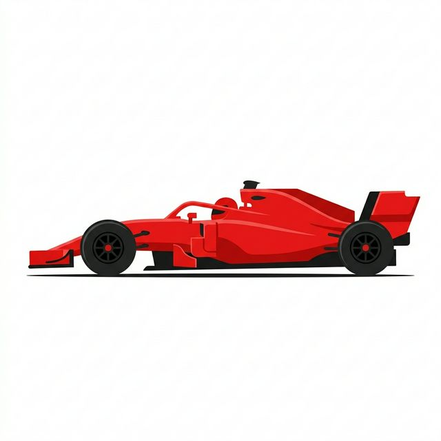

# 🏎️ F1 Race Replay Visualizer


Welcome to the **F1 Race Replay Visualizer**, a full-stack web application designed to bring historical Formula 1 race data to life! Sourced from the powerful `FastF1` Python library, this app allows you to animate and replay real F1 race telemetry (2018–present) on an interactive 2D circuit map.

<div align="center">
  
</div>

## ✨ Features

- **Full Race Animation:** Replay all 20 cars moving with accurate team colors and driver labels.
- **Variable Playback Speed:** Watch the race at 0.5x, 1x, 2x, 5x, or 10x speeds.
- **Live Leaderboards:** Real-time leaderboard with gap-to-leader metrics and current tyre compounds.
- **Race Events:** Visual highlights for safety car periods, pit stops, and race incidents.
- **Extensive Archive:** Select any race round from 2018 up to the 2025 season.


## 🏗️ Architecture Stack

This project uses a modern 3-tier architecture:

- **Frontend:** React + Vite, utilizing HTML5 Canvas 2D for high-performance 60FPS rendering.
- **Backend:** FastAPI (Python) for rapid API responses, featuring in-memory LRU caching and gzip compression.
- **Data Layer:** `FastF1` library interacting with the official timing data, providing position telemetry, tyre info, and track status.

## 🚀 Quick Start

### 1. Clone the Repository
```bash
git clone https://github.com/SudoAnirudh/f1-race-replay
cd f1-race-replay
```

### 2. Run the Backend (FastAPI)
```bash
cd backend
pip install -r requirements.txt
uvicorn main:app --reload --port 8000
```
> API docs will be available at [http://localhost:8000/docs](http://localhost:8000/docs)

### 3. Run the Frontend (React + Vite)
In a new terminal instance:
```bash
cd frontend
npm install
npm run dev
```
> The web application will launch at [http://localhost:5173](http://localhost:5173)

### 4. Docker Deployment
Run the full stack easily with Docker:
```bash
docker-compose up --build
```
> Access the deployed app at [http://localhost:8080](http://localhost:8080)

## 🏁 Future Roadmap

- Interactive Telemetry Overlays (Speed, RPM, throttle traces)
- Head-to-Head Driver Comparison Modes
- Live Mode integration for ongoing races
- AI Race Analyst using LLMs for post-race insights

---
*Disclaimer: FastF1 and this project are unofficial and not associated with Formula One Licensing B.V. F1, FORMULA ONE, FORMULA 1, FIA FORMULA ONE WORLD CHAMPIONSHIP, GRAND PRIX and related marks are trademarks of Formula One Licensing B.V.*
